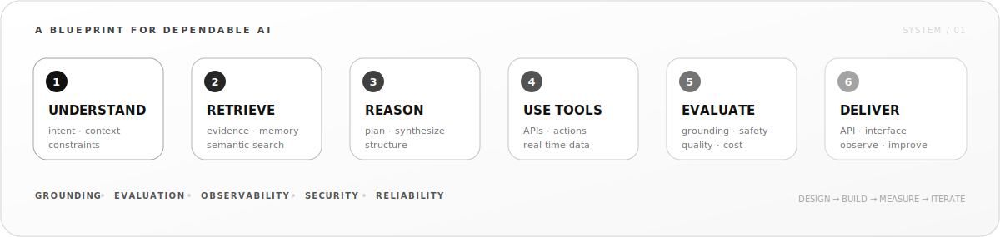

 

<a href="#selected-systems">Selected systems</a> ·
<a href="#what-i-engineer">Capabilities</a> ·
<a href="#system-blueprint">Blueprint</a> ·
<a href="#engineering-signal">Activity</a> ·
<a href="#lets-build">Connect</a>

  

---

<table>
<tr>
<td width="31%" align="center" valign="middle">
  
   
  <strong>Lahore, Pakistan → building for the world</strong>
</td>
<td width="69%" valign="middle">

## AI should do more than generate text.

I engineer **grounded AI systems** that can search, retrieve, reason over evidence, use tools, and deliver useful outputs through production-ready interfaces.

My work sits where **LLMs, retrieval, agents, machine learning, and backend engineering** meet. I care about the parts that turn a convincing prototype into dependable software: source quality, evaluation, error handling, security, observability, and a clean path to deployment.

**Right now:** advancing agent orchestration, RAG evaluation, secure multi-user systems, and reliable AI delivery.

</td>
</tr>
</table>

## Selected systems

<table>
<tr>
<td width="50%" valign="top">

### 01 — [JACK · AI Fact Verification](https://github.com/HashirLodhi/JACK)

Deploys specialized AI agents to research a claim, verify whether it was made, investigate what happened, and return a citation-backed verdict.

**Signal:** multi-agent reasoning · neural web search · source-linked results

`Python` `Flask` `Groq` `Exa` `JavaScript`

[**View code →**](https://github.com/HashirLodhi/JACK) &nbsp; [**Try live demo ↗**](https://jack-ruddy.vercel.app)

</td>
<td width="50%" valign="top">

### 02 — [LegalizeAI · Pakistani Legal RAG](https://github.com/HashirLodhi/Legalize-AI)

Answers questions against the Constitution of Pakistan and Pakistan Penal Code using retrieval-augmented generation and persistent conversational context.

**Signal:** document grounding · semantic retrieval · domain safety

`LangChain` `ChromaDB` `Groq` `Sentence Transformers`

[**View code →**](https://github.com/HashirLodhi/Legalize-AI)

</td>
</tr>
<tr>
<td width="50%" valign="top">

### 03 — [Travel Agent · Live AI Planner](https://github.com/HashirLodhi/Travel-Agent)

Creates personalized day-by-day itineraries using live weather, web research, budget constraints, local recommendations, and follow-up chat.

**Signal:** tool integration · real-time data · deployable product

`Python` `Flask` `Groq` `Exa` `OpenWeatherMap`

[**View code →**](https://github.com/HashirLodhi/Travel-Agent) &nbsp; [**Try live demo ↗**](https://travel-agent-mu-one.vercel.app)

</td>
<td width="50%" valign="top">

### 04 — [AirCanvas · Gesture Computing](https://github.com/HashirLodhi/Air-Canvas)

Turns hand landmarks into a touch-free drawing interface with real-time gesture classification, Bézier smoothing, erasing, and lasso selection.

**Signal:** computer vision · interaction design · real-time processing

`Python` `OpenCV` `MediaPipe` `NumPy`

[**View code →**](https://github.com/HashirLodhi/Air-Canvas)

</td>
</tr>
</table>

[**Explore all public repositories →**](https://github.com/HashirLodhi?tab=repositories)

## What I engineer

<table>
<tr>
<td width="25%" valign="top">

### 01 / Agentic AI

Tool use, multi-step reasoning, orchestration, structured outputs, memory, and controlled autonomy.

</td>
<td width="25%" valign="top">

### 02 / Knowledge systems

Document ingestion, embeddings, vector search, reranking, grounded answers, and citations.

</td>
<td width="25%" valign="top">

### 03 / Applied ML

NLP, deep learning, computer vision, model evaluation, data analysis, and experimentation.

</td>
<td width="25%" valign="top">

### 04 / AI delivery

REST APIs, validation, Docker, authentication, monitoring, deployment, and CI/CD thinking.

</td>
</tr>
</table>

### Stack by layer

| Layer | Tools I work with |
| --- | --- |
| **Models & orchestration** | OpenAI API · Gemini · Groq · Hugging Face · LangChain · LlamaIndex · LangGraph |
| **Retrieval & evaluation** | ChromaDB · FAISS · Pinecone · embeddings · hybrid search · RAGAS · LangSmith |
| **ML & data** | Python · PyTorch · TensorFlow · scikit-learn · pandas · NumPy · OpenCV |
| **APIs & applications** | FastAPI · Flask · REST · structured outputs · Gradio · SQL |
| **Delivery** | Docker · Git · GitHub Actions · Vercel · CI/CD · logging · monitoring |

## System blueprint

<strong>How I move from an AI idea to dependable software</strong>

 

1. **Frame the problem** — define users, constraints, expected behavior, and measurable outcomes.
2. **Design the intelligence** — choose models, retrieval, memory, tools, and control flow deliberately.
3. **Build modularly** — keep prompts, retrieval, business logic, integrations, and interfaces separable.
4. **Add trust boundaries** — validate inputs and outputs, handle failure, protect secrets, and refuse safely.
5. **Evaluate the system** — measure retrieval quality, grounding, task success, latency, and cost.
6. **Ship and observe** — document, containerize, deploy, monitor, learn from usage, and iterate.

## Engineering signal

<picture>
  <source media="(prefers-color-scheme: dark)" srcset="https://streak-stats.demolab.com?user=HashirLodhi&amp;theme=transparent&amp;hide_border=true&amp;disable_animations=true&amp;background=00000000&amp;stroke=e5e5e5&amp;ring=e5e5e5&amp;fire=ffffff&amp;currStreakLabel=e5e5e5&amp;sideLabels=a3a3a3&amp;currStreakNum=ffffff&amp;sideNums=e5e5e5&amp;dates=a3a3a3" />
  <source media="(prefers-color-scheme: light)" srcset="https://streak-stats.demolab.com?user=HashirLodhi&amp;theme=transparent&amp;hide_border=true&amp;disable_animations=true&amp;background=00000000&amp;stroke=404040&amp;ring=525252&amp;fire=171717&amp;currStreakLabel=525252&amp;sideLabels=737373&amp;currStreakNum=171717&amp;sideNums=404040&amp;dates=737373" />
  
</picture>

<picture>
  <source media="(prefers-color-scheme: dark)" srcset="https://github-readme-activity-graph.vercel.app/graph?username=HashirLodhi&amp;bg_color=00000000&amp;color=a3a3a3&amp;line=e5e5e5&amp;point=ffffff&amp;area=true&amp;area_color=404040&amp;hide_border=true&amp;custom_title=Contribution%20Activity" />
  <source media="(prefers-color-scheme: light)" srcset="https://github-readme-activity-graph.vercel.app/graph?username=HashirLodhi&amp;bg_color=00000000&amp;color=737373&amp;line=404040&amp;point=a3a3a3&amp;area=true&amp;area_color=d4d4d4&amp;hide_border=true&amp;custom_title=Contribution%20Activity" />
  
</picture>

<picture>
  <source media="(prefers-color-scheme: dark)" srcset="https://raw.githubusercontent.com/HashirLodhi/HashirLodhi/output/github-contribution-grid-snake-dark.svg" />
  <source media="(prefers-color-scheme: light)" srcset="https://raw.githubusercontent.com/HashirLodhi/HashirLodhi/output/github-contribution-grid-snake.svg" />
  
</picture>

## Beyond the build

- I write about AI and what I learn on [Medium](https://medium.com/@hashirlodhi145).
- I enjoy understanding systems from the backend outward—not just what works, but why.
- Outside code, I reset by exploring new places, cultures, and ideas.

## Let's build

### Have a difficult AI problem or a product worth making real?

I'm open to **AI engineering roles**, **collaborations**, and projects where thoughtful engineering matters.

  

> **I don't just connect models to interfaces. I engineer the path from uncertainty to a useful, verifiable result.**

Designed and engineered by Muhammad Hashir Lodhi.

