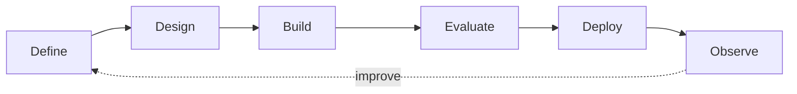

<div align="center">


### Hi there, I'm Hashir 👋

[](https://git.io/typing-svg)

I design **reliable, grounded, and production-oriented AI systems** that retrieve knowledge, reason over evidence, use real-world tools, and deliver measurable value.

[](https://github.com/HashirLodhi)
[](https://github.com/HashirLodhi?tab=followers)
[](mailto:hashirlodhi145@gmail.com)

[](https://www.linkedin.com/in/hashir-lodhi/)
[](https://medium.com/@hashirlodhi145)
[](mailto:hashirlodhi145@gmail.com)
[](https://www.google.com/maps/place/Lahore)

</div>

---

## ⚡ About me

```python
hashir = {
    "role": "AI Engineer",
    "building": ["LLM applications", "RAG systems", "AI agents"],
    "cares_about": ["grounding", "evaluation", "reliability", "clean APIs"],
    "currently_learning": ["LangGraph", "RAGAS", "LangSmith", "MLOps"],
    "mission": "Move AI beyond demos and into practical use."
}
```

- 🧠 I build LLM applications, domain assistants, agentic workflows, and retrieval pipelines.
- 🔍 I improve answer grounding, source quality, retrieval performance, and evaluation.
- ⚙️ I develop REST APIs, tool integrations, structured outputs, and deployable backends.
- 👁️ I also work across machine learning, NLP, deep learning, and computer vision.
- 🌍 Based in **Lahore, Pakistan** and open to meaningful global collaborations.

## 🚀 Featured work

<table>
<tr>
<td width="50%" valign="top">

### [JACK — AI Fact-Checking System](https://github.com/HashirLodhi/JACK)

Multi-agent claim verification with automated research, contradiction analysis, source-quality scoring, and citation-backed verdicts.

`Python` `LLM APIs` `Groq` `Exa` `Flask`

</td>
<td width="50%" valign="top">

### [LegalizeAI — Pakistani Legal Assistant](https://github.com/HashirLodhi/Legalize-AI)

Grounded legal Q&A across Pakistani constitutional and criminal-law documents with page-level citations and safe refusal handling.

`LangChain` `ChromaDB` `Gemini` `Gradio`

</td>
</tr>
<tr>
<td width="50%" valign="top">

### [Agentic Travel Planner](https://github.com/HashirLodhi/agentic-travel-planner)

Researches destinations, checks live information, estimates budgets, builds itineraries, and exports complete travel plans.

`Python` `Groq` `Exa` `Weather APIs` `Flask`

</td>
<td width="50%" valign="top">

### [RAG-Agent — Document Intelligence API](https://github.com/HashirLodhi/RAG-Agent)

Isolated multi-PDF question answering with semantic retrieval, citations, conversation history, evaluation endpoints, and Docker support.

`FastAPI` `LangChain` `ChromaDB` `Docker`

</td>
</tr>
</table>

<div align="center">

[](https://github.com/HashirLodhi?tab=repositories)

</div>

## 🛠️ Technology arsenal

<div align="center">

### AI, agents & retrieval


### Machine learning & data


### Backend, data & delivery


</div>

## 🧩 How I build



<details>
<summary><strong>My engineering approach</strong></summary>
<br>

1. Define the problem, expected behavior, and measurable outcomes.
2. Select the right model, retrieval strategy, or machine-learning approach.
3. Build a modular backend and integrate the required tools and APIs.
4. Add validation, error handling, security controls, and structured outputs.
5. Evaluate retrieval quality, answer grounding, and model performance.
6. Package the application with documentation, deployment, and observability.

</details>

## 📊 GitHub intelligence

<div align="center">


[](https://github.com/HashirLodhi)

</div>

## 🎯 Current focus

| Exploring | Engineering toward |
| --- | --- |
| LangGraph and advanced agent orchestration | Robust multi-agent workflows |
| RAGAS, LangSmith, and systematic evaluation | Measurable AI quality |
| Authentication and multi-user architecture | Secure production systems |
| CI/CD, monitoring, and cloud deployment | Reliable AI delivery |

## 🤝 Let's build something useful

<div align="center">

### Have an AI idea, research challenge, or ambitious product in mind?

I'm open to **AI engineering projects**, **collaborations**, **learning opportunities**, and meaningful technical challenges.

[](mailto:hashirlodhi145@gmail.com)
[](https://www.linkedin.com/in/hashir-lodhi/)
[](https://medium.com/@hashirlodhi145)

> **Building AI systems that move beyond demos and toward practical use.**


</div>
